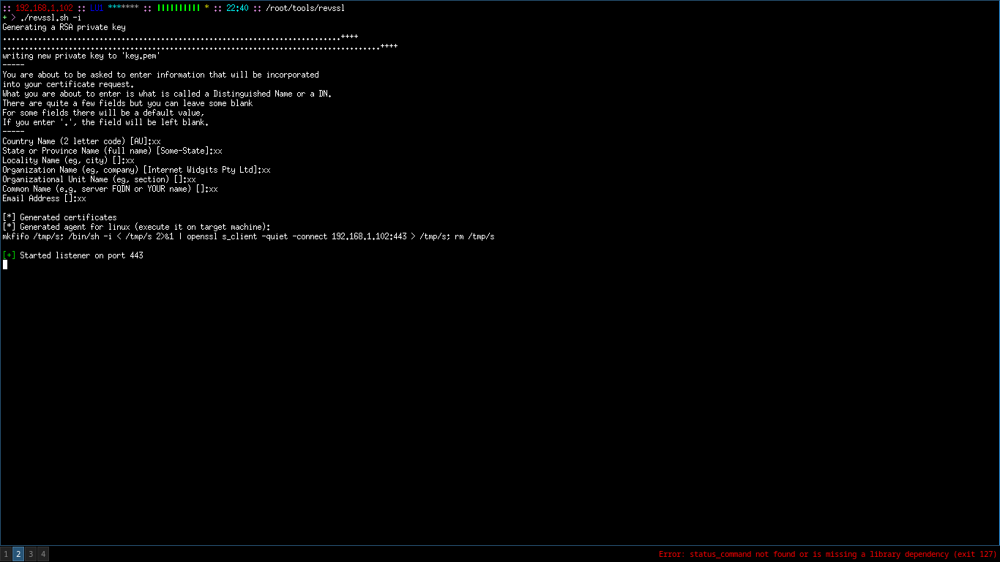

<p align="center">
  <a>
    
  </a>
</p>

<p align="center">
 A simple Bash script that makes generation of OpenSSL reverse shells painless
</p>


## Table of Contents

- [Introduction](#introduction)
- [Usage](#usage)
- [Screenshot](#screenshot)
- [License](#license)

## Introduction
Revssl was created mainly to automate the OpenSSL reverse shell idea [from here](https://medium.com/@int0x33/day-43-reverse-shell-with-openssl-1ee2574aa998), and pack it into a single
script. It can generate agents both for Linux and Windows, providing a secure and encrypted remote control channel. I am still working on OSX implementation. 
This code isn't perfect, so feel free to open new issues and contribute :D 

## Usage
```
usage: revssl [-h] [-i] [-e <encryption>] [-d <days>] [-l <lhost>]
              [-p <lport>] [-k <keyname>] [-c <certname>] [-p <platform>]
              [-o] [-n <outfile>] [-s <domain>] [-r]
options:
 -h     Show help message
 -i     Initiate listener in OpenSSL
 -e <encryption>
        Choose encryption type (default: rsa:4096)
 -d <days>
        Set certificates lifetime
 -l <lhost>
        Set listening host (default: 192.168.1.102)
 -p <port>
        Set listening port (default: 443)
 -k <keyname>
        Set name of generated key file (default: key.pem)
 -c <certname>
        Set name of generated cert file (default: cert.pem)
 -p <platform>
        Select agent platform (windows or linux, default: linux)
 -s <domain>
        Domain name for Windows Powershell agent (default: domain.xyz)
 -o     Write agent to a file
 -n <outfile>
        Select name of the agent file (default: openssl_revshell)
 -r     Remove generated certificates after established session
```
## Screenshot
<p align="center">
  <a>
    
  </a>
</p>

## License
This software is under [MIT License](https://en.wikipedia.org/wiki/MIT_License)


